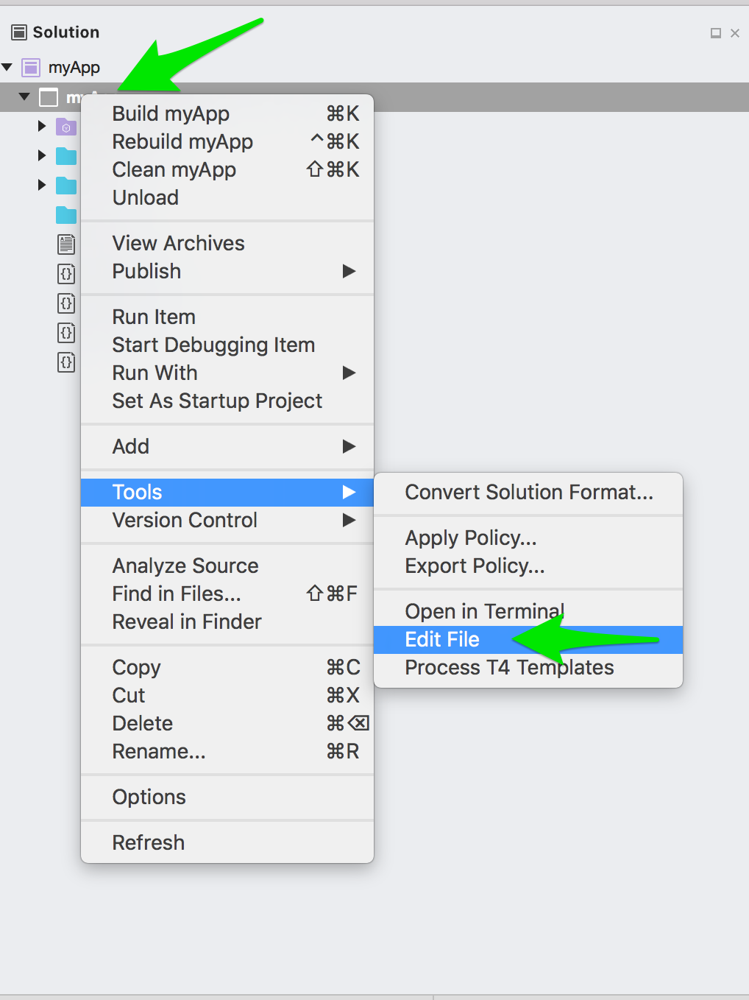
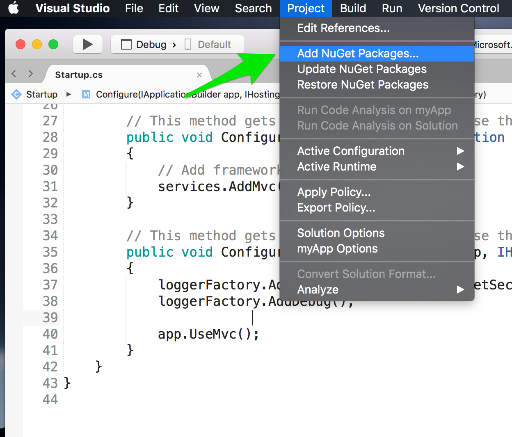
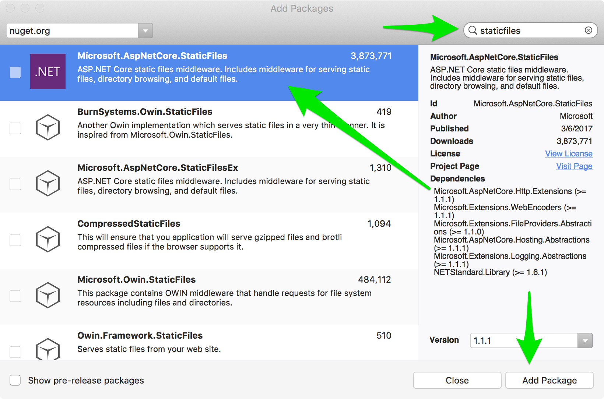
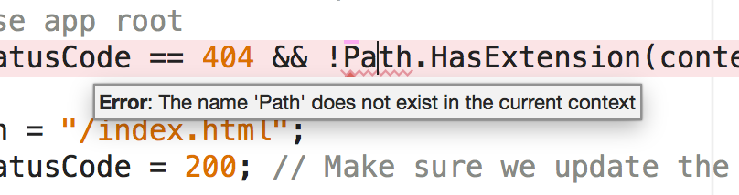
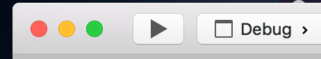

# Getting Angluar CLI working in a .NET Core application in Visual Studio for Mac

Thanks to Dustin Ewers and [his blog post](https://dustinewers.com/angular-cli-with-net-core/) for inspiration for this article. Since I come from a frontend perspective and doing devlopment on a Mac rather than Windows there are just a few things I wanted to do differently.

I'm a big fac of the [Angular CLI](https://cli.angular.io/) and if I'm going Angular development I REALLY want to have those tools available to me. Also since my native machine is a Mac and .NET Core runs on a Mac and there is now [Visual Studio for Mac Preview](https://www.visualstudio.com/vs/visual-studio-mac/) this is a great time to try to get a .NET app using the Angluar CLI up and running completely on a Mac. So here we go!


## Setting up prerequisites

Steps

It probably goes without saying but you do need to install the [.NET Core sdk for MacOS](https://www.microsoft.com/net/download/core). You'll also need [Node](https://nodejs.org/en/) 6.9.0 or higher. You can just install the one version as is or you can use [nvm](https://github.com/creationix/nvm#install-script). I like nvm because it allows for easy node version management so that's what we're going to go with for this tutorial.

Now that you have [.Net Core sdk](https://www.microsoft.com/net/download/core) installed and [nvm](https://github.com/creationix/nvm#install-script) installed you need to install the [Angular CLI](https://cli.angular.io/) globally.

```shell
> npm install -g @angular/cli
```

We've got all our prerequisites taken care of it's time to start building our app!

## Create the .NET app


From your terminal open the location where you want your app folder to live. You'll use the `dotnet` command to create your app.

```shell
> dotnet new webapi --name myApp
```

If all goes as planned you should see the following in your terminal:

```shell
Content generation time: 100.7168 ms
The template "ASP.NET Core Web API" created successfully.
```


## Setup Angular CLI app

Make your way into your newly created `myApp` folder and we'll start getting the Angular stuff setup.

```shell
> cd /myApp
```

In order for the Angluar CLI to work you'll need to have [Node](https://nodejs.org/en/) 6.9.0 or higher. Hopefully you chose to use [nvm](https://github.com/creationix/nvm#install-script) for this. If you did, then the best thing to do is to create a `.nvmrc` file and specify the version of node you want to use for your project. I always like to be on the bleeding edge so I'm going with version 7.9.0 which is the current version at the time of writing.

Create the `.nvmrc` file. Make sure you are in the `/myApp` folder before creating it.

```shell
> echo "7.8.0" > .nvmrc
```

This should have created the `.nvmrc` file and set the contents to "7.8.0". Run `nvm use`.

```shell
> nvm use
```

`nvm use` and it will look at the `.nvmrc` file and use the node version specified in the file. If the node version is not installed it will install it for you then switch to it automatically.

```shell
Found '/Users/bmcalister/Documents/blog/dotnet-core-angular-cli-mac/myApp/.nvmrc' with version <7.8.0>
Now using node v7.8.0 (npm v4.2.0)
```

## Using Angular CLI to Build the Angular App

It's time to add the Angular piece. This is one place where I have a different opinion from [Dustin](https://dustinewers.com/angular-cli-with-net-core/) on how to structure the project. I prefer to keep all of the Angular related things in it's own folder rather than in the root of the .NET app. That being said, either way is probably fine I just prefer to keep things as compartmentalized as possible. I'm going to create my Angular app in a folder named `client` because that just makes sense to me. You do you.

```shell
> ng new client
```

You will now be able to cd into the '/client' folder and run any of the angluar cli commands as usual. BUT we are trying to integrate our Angular App into our .NET app so there's still a few more things we need to do.


## Setting up the details from Dustin's Blog

The first thing we need to do it to ensure that we let the Angular CLI compile the TypeScript rather than Visual Studio. To do that we need to edit the `myApp.csproj` file for our app. First we need to launch the project in [Visual Studio Preview for Mac](https://www.visualstudio.com/vs/visual-studio-mac/). An easy way to do that is to use the `open` command.

```shell
> open myApp.csproj
```

Now that the project is open, we need to edit the `myApp.csproj` file. To open the file right-click on your project, myApp in this case, in the Solution Explorer. Navigate to "Tools" -> "Edit File".


Here is where you need to add the following line in the `<PropertyGroup></PropertyGroup>` tag.

```xml
<TypeScriptCompilerBlocked>true</TypeScriptCompilerBlocked>
```

Your `myApp.csproj` file should look like this after adding the `TypeScriptCompilerBlocked` line.

```xml
<Project Sdk="Microsoft.NET.Sdk.Web">

  <PropertyGroup>
    <TargetFramework>netcoreapp1.1</TargetFramework>
    <TypeScriptCompilerBlocked>true</TypeScriptCompilerBlocked>
  </PropertyGroup>

  <ItemGroup>
    <Folder Include="wwwroot\" />
  </ItemGroup>

  <ItemGroup>
    <PackageReference Include="Microsoft.AspNetCore" Version="1.1.1" />
    <PackageReference Include="Microsoft.AspNetCore.Mvc" Version="1.1.2" />
    <PackageReference Include="Microsoft.Extensions.Logging.Debug" Version="1.1.1" />
  </ItemGroup>

</Project>
```

Save that file and close it. We are done with it.


Next we need to edit the `.angular-cli.json` file so our Angular CLI will build to the `wwwroot` folder of our .NET app.


Change:
```json
"root": "src",
"outDir": "dist",
```

to:
```json
"root": "src",
"outDir": "../wwwroot",
```

We want to leave the root folder set as "src" since we're running our entire Angular app from within the client folder.

Next we need to install the “[Microsoft.AspNetCore.StaticFiles](https://www.nuget.org/packages/Microsoft.AspNetCore.StaticFiles/)” NuGet package and configure the `Startup.cs` file to use our Angular build files. All the credit for this section goes to [Dustin Ewers](https://dustinewers.com/angular-cli-with-net-core/).

Install the “Microsoft.AspNetCore.StaticFiles” NuGet package.

Click on "Project" -> "Add NuGet Pacakges"



Search for "staticfiles" and you should see “Microsoft.AspNetCore.StaticFiles” at the top of the results list. Make sure it's highlighted then click "Add Package".


Alternatively you can install it using the .NET Core CLI.

```shell
> dotnet add package Microsoft.AspNetCore.StaticFiles
```

We need to take advantage of “Microsoft.AspNetCore.StaticFiles" and add a couple of methods to make our app use the Angular build files. Add these two lines just above the `app.UseMvc();` line in `Startup.cs`.

```csharp
app.UseDefaultFiles();
app.UseStaticFiles();
```


Now it's time to add some middleware courtesy of [Dustin](https://dustinewers.com/angular-cli-with-net-core/) to our `Startup.cs` to redirect any 404 errors to the root file of our app.

Add this block of code just under the `loggerFactory.AddDebug();` in the Cofigure method.

```csharp
app.Use(async (context, next) =>
{
  await next();

  // If there's no available file and the request doesn't contain an extension, we're probably trying to access a page.
  // Rewrite request to use app root
  if (context.Response.StatusCode == 404 && !Path.HasExtension(context.Request.Path.Value) && !context.Request.Path.Value.StartsWith("/api"))
  {
    context.Request.Path = "/index.html";
    context.Response.StatusCode = 200; // Make sure we update the status code, otherwise it returns 404
    await next();
  }
});
```

At the point Visual Studio will probably yell at you because `Path` does not exist in the current context.



To solve this you'll need to at a using statement for `System.IO` to the top of your `Startup.cs` file.

```csharp
using System.IO;
```


Your Configure() method in the `Startup.cs` file should now look like this

```csharp
...
using System.IO;
...

public void Configure(IApplicationBuilder app, IHostingEnvironment env, ILoggerFactory loggerFactory)
{
    loggerFactory.AddConsole(Configuration.GetSection("Logging"));
    loggerFactory.AddDebug();

    app.Use(async (context, next) =>
    {
      await next();

      // If there's no available file and the request doesn't contain an extension, we're probably trying to access a page.
      // Rewrite request to use app root
      if (context.Response.StatusCode == 404 && !Path.HasExtension(context.Request.Path.Value) && !context.Request.Path.Value.StartsWith("/api"))
      {
        context.Request.Path = "/index.html";
        context.Response.StatusCode = 200; // Make sure we update the status code, otherwise it returns 404
        await next();
      }
    });

    app.UseDefaultFiles();
    app.UseStaticFiles();

    app.UseMvc();
}
```

The Setup is complete!

Now you can start building your app. The best part about this for me since I'm a Frontend developer just getting my feet wet in backend developement and .NET I can still use the Angular CLI tools like I'm used to.


## Running your app from within Visual Studio

All you really have to do to run the WebAPI part of your app is to push the fancy "play" button in Visual Studio.



However, this will not run the Angular piece of the app until you build it using `ng build`. When you run `ng build` it will build the Angular app into the `/wwwroot` which is where Visual Studio looks for your app.

```shell
> ng build
```


* ng build will build the frontend to the wwwroot file. This will be the ui that is run when the app is run in VS
* You can also do dev by starting the app in VS and also running ng serve from within the client folder. This gives you the best of both worlds working with the CLI and your .NET api.

